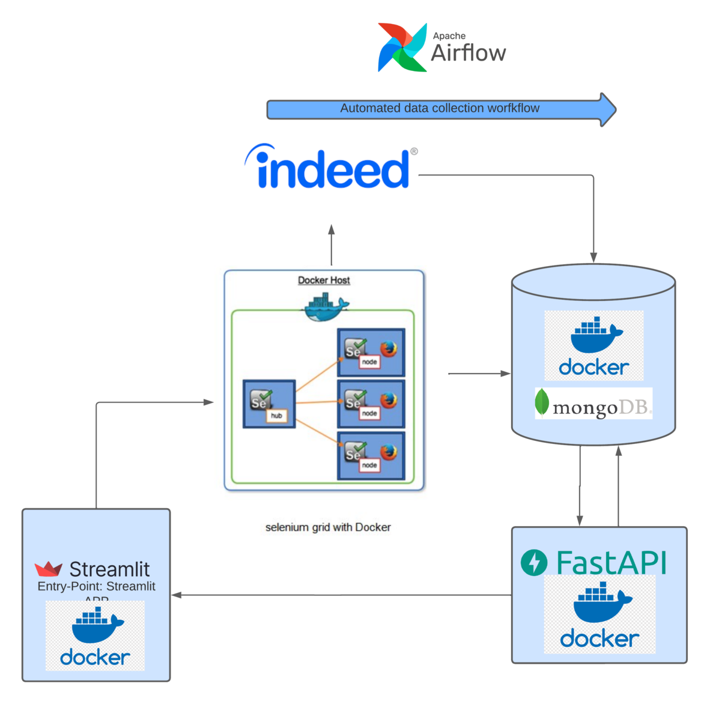

# Monitoring Data Jobs
This project is a system that utilizes web scraping to collect job descriptions for different data jobs positions from Indeed.com on a daily basis. The system then analyses the collected data and displays the most in-demand technologies for these data positions and presents the insights as interactive visuals. The project can be cloned and modified easily for fit different industries. The system is built on a micro-service architechture containing multiple micro-services that communicate with each other in order to perform the different tasks.


## The Pipeline
### The system is deployed on azure VM 


## Main technologies
* [Python](https://www.python.org/), the programming used to build the logic
* [Airflow](https://airflow.apache.org/), was used to automate the workflow for the data collection from Indeed.com
* [FastAPI](https://fastapi.tiangolo.com), was used to deploy the resume parsing and similarity computation 
* [Streamlit](https://streamlit.io), was used to build the dashboards and be the entrypoint to interact with the system
* [Docker](https://www.docker.com/), was used to deploy the microservices in isolated containers that communicate wit eachothers 
* [Selenium](https://www.selenium.dev/documentation/grid/), was used to collect the data of the different job positions from Indeed.com
* [MongoDB](https://www.mongodb.com/), was the database of choice in order to store the data collected the workflow


## Run The APP: The app is quite heavy you should have a quite capable computer


1. in the root directory we can launch the docker-compose that will launch all of the services but the airflow service that has it's own docker-compose file
```
docker-compose up --build -d 
```

2. under the folder orchestration_server_jobs_data run the docker-compose file responsible of launching the airflow service 

```
echo -e "AIRFLOW_UID=$(id -u)" > .env
docker compose up airflow-init
docker-compose up 
```
